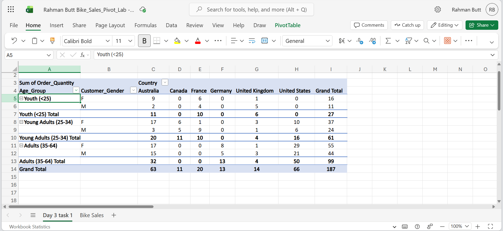
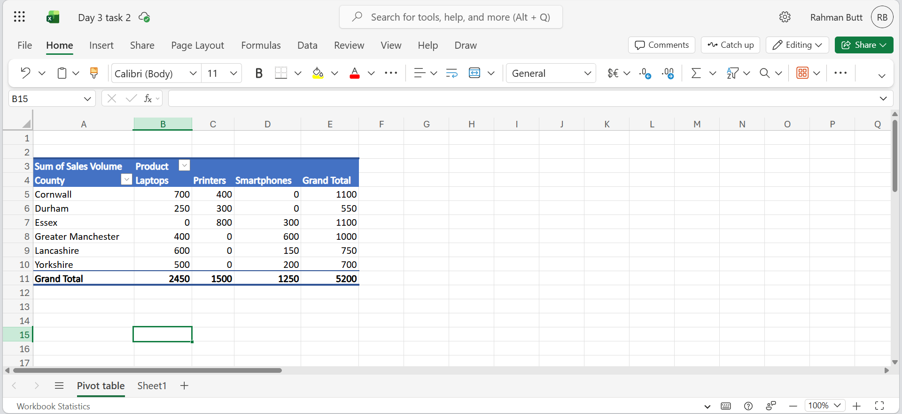
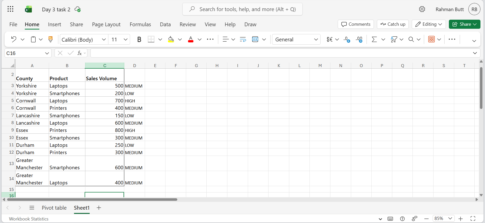
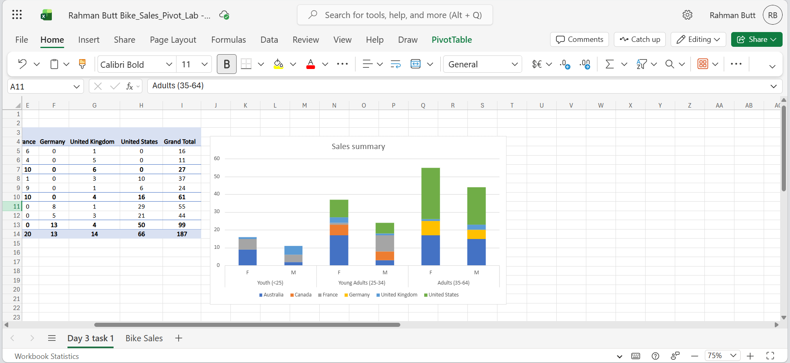

# 📊 Excel Data Analysis: Sales Insights with Pivot Tables & SWITCH

Week 1 project from the Leep Data Technician Skills Bootcamp. Uses Excel pivot tables, a nested `SWITCH` formula, and a PivotChart to turn two raw sales datasets into business insights.

## 📝 Overview

This project covers three tasks built around two datasets: a bike sales dataset (orders by age group, gender, and country) and a regional electronics sales dataset (county, product, sales volume). The goal was to practice summarising raw data, categorising it with formulas, and visualising it for reporting.

## 🧠 Skills Gained

- **Pivot Tables** – grouping and cross-tabulating raw transaction data by multiple dimensions (age group, gender, country, county, product) to summarise thousands of rows into readable tables
- **Nested logical functions (`SWITCH`)** – writing a formula to automatically categorise every row of data (High/Medium/Low) based on multiple conditions, instead of tagging it manually
- **Data visualisation** – building a stacked PivotChart to compare sales across categories at a glance
- **Data interpretation** – reading a pivot table to answer specific business questions (e.g. "which country sells in every market?") rather than just producing the table

## 🗂️ Task Breakdown

### 1️⃣ Bike Sales Pivot Table Analysis
**Dataset:** `Bike_Sales_Pivot_Lab.xlsx`

Built a pivot table summarising **Order Quantity** by **Age Group** and **Customer Gender** (rows) against **Country** (columns).



💡 Insights pulled from the table:
- Germany's only customers fall in the 35–64 age group
- The UK and Australia are the only countries with sales across every age group
- The US is the most profitable country when broken down by age group and gender
- In every age group, women bought more bikes than men overall
- Canada and Germany each sell in only one age group

### 2️⃣ County & Product Sales Categorisation
**Dataset:** Regional electronics sales data (County, Product, Sales Volume), entered manually

Built a pivot table summarising **Sales Volume** by **County** (rows) and **Product** (columns):



Then added a nested `SWITCH` formula to classify each row by sales volume without manual tagging:

```excel
=SWITCH(TRUE, C2 > 600, "High", C2 >= 300, "Medium", "Low")
```



### 3️⃣ Sales Data Visualisation
**Dataset:** `Bike_Sales_Visualizations_Lab.xlsx`

Built a stacked column PivotChart showing order volume by age group and gender, split by country, to make cross-market patterns easier to spot than in a table alone. 



## 🛠️ Tools

Microsoft Excel — Pivot Tables, PivotCharts, `SWITCH` function

## 🎓 About

Completed as part of Week 1 (Introduction to Data & Excel) of the [Leep Talent Data Technician Skills Bootcamp](https://leepgroup.com), August 2026.
